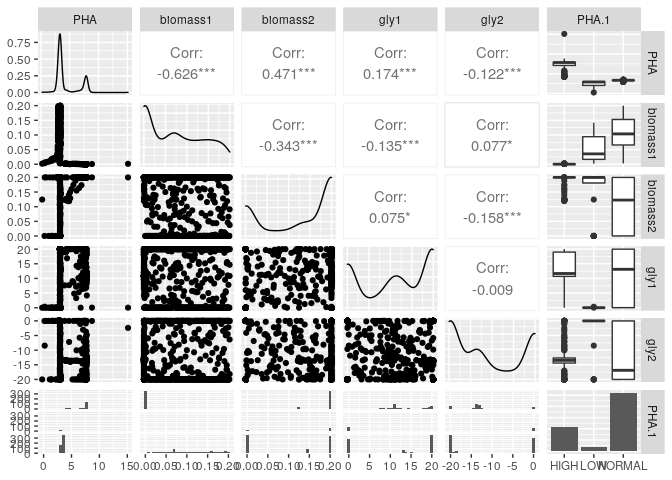
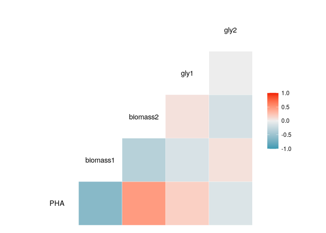
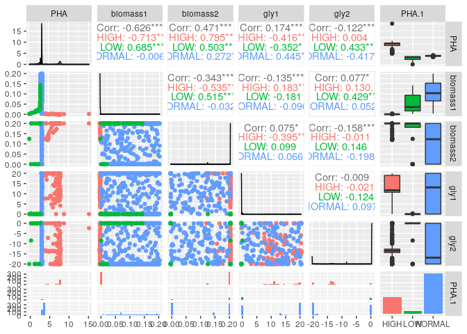
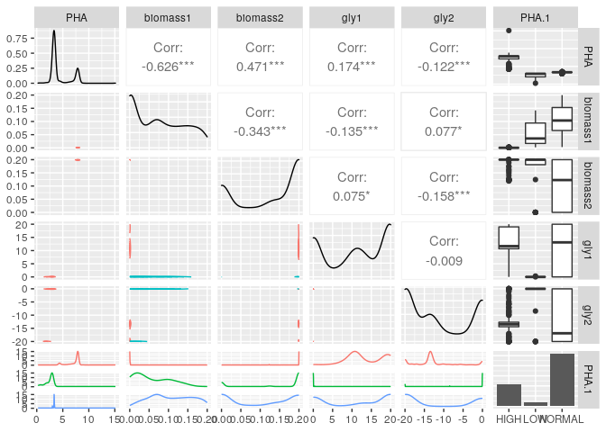
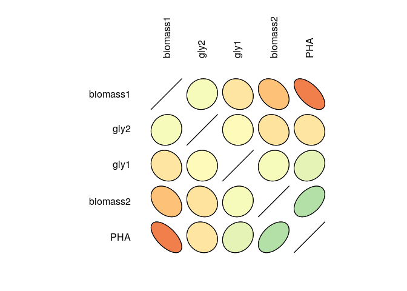

R Notebook
================

# Analysis of PET degradation results - FLYCOP

-----

## Reading data

``` r
options(warn = -1) 
data=read.table("data.txt",sep="\t",header=TRUE,row.names = 1)
```

## Some plots

### Correlation matrix

The groups are defined by: \* PHA\>3.5 = HIGH \* PHA\<3.5 AND PHA \> 3.0
= NORMAL \* PHA\<3.0 = LOW


### Correlation plot

``` r
ggcorr(data)
```



### Splitting by group

``` r
ggpairs(data,ggplot2::aes(colour=PHA.1))
```



### Density plots

``` r
ggpairs(
  data,
  lower = list(continuous = "density", 
               combo = "facetdensity",
               mapping=ggplot2::aes(colour=PHA.1))
)
```



### Ellipse plot

``` r
library(ellipse)
library(RColorBrewer)
datacor=cor(data[,1:5])
my_colors <- brewer.pal(5, "Spectral")
my_colors <- colorRampPalette(my_colors)(100)
ord <- order(datacor[1, ])
data_ord <- datacor[ord, ord]
plotcorr(data_ord , col=my_colors[data_ord*50+50] , mar=c(1,1,1,1)  )
```


